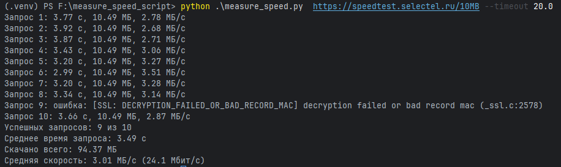

# Замер скорости скачивания

Консольный скрипт на Python. Скачивает файл по заданному URL несколько раз подряд и печатает среднее время запроса, объём скачанных данных и среднюю скорость в МБ/с.

Подойдёт любой тяжёлый файл или картинка, доступные по HTTP(S).

## Что делает скрипт

1. Принимает адрес, к которому нужно обратиться.
2. Последовательно выполняет 10 запросов (число настраивается) и после каждого дожидается полной загрузки ответа.
3. Для каждого запроса печатает время, объём и скорость.
4. В конце печатает итог: число успешных запросов, среднее время запроса, общий объём и среднюю скорость (в МБ/с и Мбит/с).

## Требования

- Python 3.10 или новее
- библиотека [requests](https://requests.readthedocs.io/) (указана в `requirements.txt`)

## Установка

```bash
python -m venv .venv
source .venv/bin/activate        # Windows: .venv\Scripts\activate
pip install -r requirements.txt
```

## Запуск

```bash
python measure_speed.py <URL> [--count N] [--timeout СЕКУНДЫ]
```

На Linux и macOS команда может называться `python3`.

| Аргумент    | Описание                                     | По умолчанию |
|-------------|----------------------------------------------|--------------|
| `url`       | адрес файла или картинки (обязательный)      | —            |
| `--count`   | число последовательных запросов              | 10           |
| `--timeout` | таймаут запроса в секундах, должен быть > 0  | 20           |

Пример с тестовым файлом на 10 МБ (Selectel публикует тестовые файлы 10 МБ, 100 МБ, 1 ГБ и 10 ГБ):

```bash
python measure_speed.py https://speedtest.selectel.ru/10MB
```

Десять запросов к файлу на 10 МБ дают около 100 МБ трафика. Для файла на 100 МБ это уже около 1 ГБ за один запуск.

## Пример вывода





## Как считаются показатели

- **Время запроса** — от отправки запроса до полного чтения тела ответа, замер через `time.perf_counter()`. В него входит установка соединения (DNS, TCP, TLS).
- **Объём** — число байт, которые реально прочитаны из ответа. Тело читается потоком по 64 КБ, файл не сохраняется ни в память целиком, ни на диск.
- **Среднее время запроса** — сумма времени успешных запросов, делённая на их число.
- **Средняя скорость** — суммарный объём всех успешных запросов, делённый на суммарное время этих запросов. Это не среднее из скоростей отдельных запросов и не время работы всей программы.
- **Единицы:** 1 МБ = 10⁶ байт; Мбит/с = МБ/с × 8.

Запросы, которые завершились ошибкой (проблема с сетью, таймаут, ответ со статусом 4xx/5xx), печатаются с сообщением об ошибке и в подсчёт итогов не входят.

## Коды выхода

| Код | Значение                                              |
|-----|-------------------------------------------------------|
| 0   | измерение выполнено                                   |
| 1   | ни один запрос не удался                              |
| 2   | неверные аргументы командной строки                   |

## Ограничения

- Запросы выполняются последовательно, в один поток. На быстрых каналах один поток может не выбрать всю пропускную способность.
- Каждый запрос открывает новое соединение, поэтому DNS, TCP и TLS входят в измеряемое время.
- `--timeout` — это таймаут библиотеки `requests`: ожидание соединения и паузы между порциями данных. Общий лимит на скачивание он не задаёт.
- Данные читаются после распаковки. Если сервер отдаёт файл со сжатием (gzip), посчитанный объём будет больше, чем прошло по сети. Для картинок и бинарных файлов это обычно не проявляется.
- Результат зависит от сервера, кэша и CDN, загрузки сети и качества Wi-Fi. На небольших файлах заметную долю времени занимают установка соединения и разгон TCP, поэтому для быстрых каналов берите файл побольше.